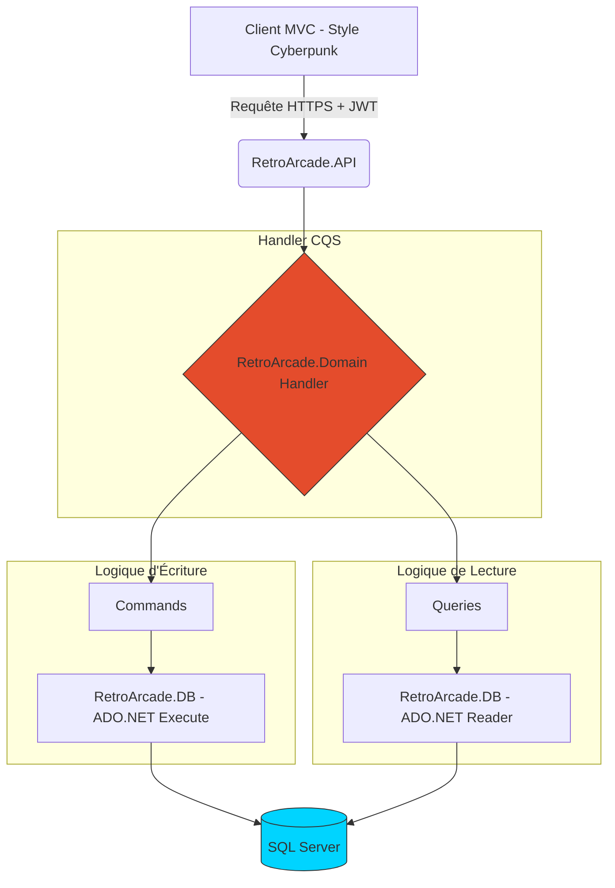
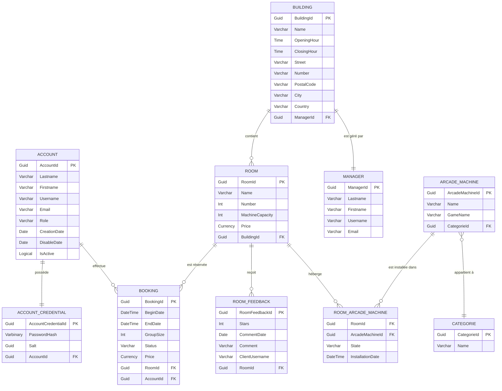

🕹️ Retro’s Arcade Room

    La plateforme qui digitalise l'arcade.
    L'alliance de la performance brute ADO.NET et d'une esthétique Cyberpunk immersive.

Retro’s Arcade Room n'est pas qu'un simple outil de gestion. C'est un écosystème complet qui permet de piloter la rentabilité des succursales en temps réel tout en honorant l'héritage du rétrogaming.

🏛️ Architecture de la Solution
Le projet est segmenté en 6 modules spécialisés pour garantir une séparation stricte des responsabilités :

    RetroArcade.Blazor : Le Front-end Framework Blazor et ses composants. Un théme Retro arcade Cyberpunk minimaliste
    RetroArcade.ASPCore : Le Front-end MVC. Une interface utilisateur sombre, néon et dynamique, conçue pour l'immersion.
    RetroArcade.API : La couche de services exposant les endpoints sécurisés.
    RetroArcade.Domain : Le cœur métier (Entités, Logique de prix, Gestion des origines des machines).
    RetroArcade.DB : La couche Data optimisée. Utilisation d'ADO.NET pour un contrôle total sur les performances SQL.
    Tools.Cqs : Framework interne implémentant le pattern Command Query Separation.
    RetroArcade.Tests : Validation des fonctionnalités avec des tests XUnit.

⚡ Stack Technique

    Framework : ASP.NET Core MVC (Architecture Microservices).
    Data Access : ADO.NET (Performance brute, sans le surplus d'un ORM).
    Patterns : CQS (Command Query Separation) pour découpler les écritures des lectures.
    Sécurité : Authentification et Autorisation via JWT (JSON Web Tokens) + Refresh Token (coming soon).
    Design : UI Cyberpunk/Neon (CSS custom avec effets de scanlines et contrastes élevés).

🎮 Fonctionnalités par Profil
💎 Client (Gamer) (ongoing)

    Booking System : Réservation de bornes ou de salles privées (min. 4 personnes).
    Profil Tech : Historique des parties, notes sur les machines et consultation de la popularité "Live".

💼 Manager (Succursale) (ongoing)

    Mission Control : Gestion locale des salles, des machines et des disponibilités.
    Data Insights : Suivi des revenus et statistiques de fréquentation par plage horaire.

🛠️ RPA (Responsable des Parcs) (coming soon)

    Traçabilité Heritage : Historique complet des machines (Pays d'origine, année, déplacements inter-succursales).
    Analyse de Rentabilité : Calcul automatique de la rentabilité par rapport au prix d'achat et aux gains historiques.
    Customization : Gestion des catalogues de jeux pour les machines personnalisées.

💀 Admin (System) (ongoing)

    Full Override : Gestion complète des utilisateurs, des rôles et supervision globale de l'infrastructure.

🛠 Installation & Setup

    Prérequis : .NET SDK 8.0+ & SQL Server.
    Configuration : Modifier la chaîne de connexion dans RetroArcade.API/appsettings.json.

Partie 1 (implémentation des utilisateurs) (ongoing):

Partie 2 (implémentation des managers) (coming soon):

Partie 3 (implémentation des RPA(Responsable des Parcs)) (coming soon):
